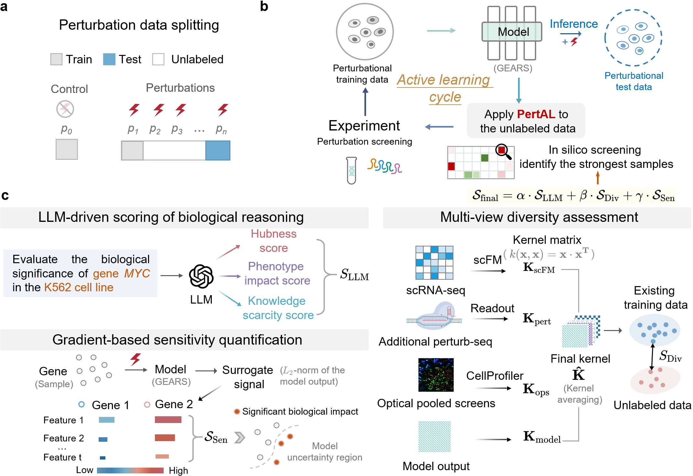

<div align="center">

# PertAL: An Efficient and Robust Active Learning Framework for Budget-Constrained Single-Cell Perturbation Screens

We introduce PertAL, a novel active learning framework to guide low-budget single-cell perturbation screening. To intelligently prioritize perturbations, PertAL integrates three key scoring modules: LLM-driven scoring of biological reasoning, multi-view diversity assessment, and gradient-based sensitivity quantification. By combining these scores, PertAL facilitates efficient exploration under strict budget constraints.

[](https://www.python.org/)
[](https://opensource.org/licenses/MIT)
[]()

[Paper]() | [Data](https://drive.google.com/drive/folders/1Hh00_cO6oRBOU6kAzhyblaJ0xhJZfyGB?dmr=1&ec=wgc-drive-globalnav-goto) | [GitHub](https://github.com/JieZheng-ShanghaiTech/PertAL)


</div>


## Overview




---


## Table of contents

- [Installation](#installation)
- [Download data](#download-data)
- [Run experiments](#run-experiments)
- [Project structure](#project-structure)
- [Acknowledgements](#acknowledgements)
- [Contact](#contact)


---

## 1. Installation

### Create a new environment

First, create a new virtual environment for PertAL. We recommend using Python 3.8.20.

```bash
# Create a new environment with Python 3.8
conda create -n pertAL python=3.8
# Activate the environment
conda activate pertAL
```

### Install dependencies
We provide two options for installing dependencies.

**Option 1:** Install from pyproject.toml

We recommend upgrading packaging tools first：
```bash
python -m pip install --upgrade pip
pip install --upgrade setuptools
```
Then install the package in editable mode:
```bash
pip install -e .
```
This will install the necessary libraries and dependencies required to run the project.


**Option 2:** Install from `requirements.txt`

```bash
pip install -r requirements.txt
```

**Note: Install PyTorch Geometric CUDA extensions**

Adjust the `--find-links` URL to match your CUDA version. The example below targets CUDA 12.4 with PyTorch 2.4:

```bash
pip install -r requirements-cuda.txt -f https://data.pyg.org/whl/torch-2.4.0+cu124.html
```

> Browse [data.pyg.org/whl](https://data.pyg.org/whl/) for other CUDA/PyTorch combinations.

### (Optional) Install Hydra support

```bash
pip install -e ".[hydra]"
```
---


## 2. Download data
Due to data size and availability restrictions, the target dataset must be manually downloaded. You can access it from the following URL: [Dataset](https://drive.google.com/drive/folders/1Hh00_cO6oRBOU6kAzhyblaJ0xhJZfyGB?dmr=1&ec=wgc-drive-globalnav-goto). Make sure to download the dataset and place it in the appropriate directory `data` before running the program.

**Step 1:** Download the data from [Dataset](https://drive.google.com/drive/folders/1Hh00_cO6oRBOU6kAzhyblaJ0xhJZfyGB?dmr=1&ec=wgc-drive-globalnav-goto).

**Step 2:** Place everything under `data/` at the project root. The expected layout:

```
data/
├── <dataset>.h5ad
|── go_essential_all
|── essential_all_data_pert_genes.pkl
|── gene2go_all.pkl
|── <dataset>_essential_1000hvg
├── <dataset>_kernels/
│   └── knowledge_kernels_1k/
│       ├── scgpt_blood/
│       ├── rpe1_kernel/
│       ├── k562_kernel/
│       ├── ops_A549_kernel/
│       ├── ops_HeLa_HPLM_kernel/
│       ├── ops_HeLa_DMEM_kernel/
│       └── biogpt_kernel/
└── Prior_kernel_preprocess.ipynb
```
> The scFM kernel (`scgpt_blood` by default) is specified via `--prior_scfm_kernel`.

> OPS data is sourced from [Broad PERISCOPE](https://github.com/broadinstitute/2022_PERISCOPE).

### Build custom kernels

If you would like to experiment with other feature sets, you can follow the workflow provided in the notebook below to generate custom feature kernels:

```bash
jupyter notebook data/Prior_kernel_preprocess.ipynb
```

###  Generate LLM priors

Two scripts in `llm/` produce the LLM-based gene scores. Both use the OpenAI-compatible API format, so they work with GPT-4.1-mini, Qwen2.5-7B-Instruct, DeepSeek-R1, or any compatible endpoint. 

:pushpin: Make sure to replace the API keys with your personal ones `API key` in the script to avoid any issues when connecting to the LLM API.

1. `llm/LLM_prior_extractor_async.py` asynchronously scores every candidate gene on three dimensions (hubness, phenotype impact, knowledge scarcity).

**Step 1:** Open the script and fill in the config block:

```python
API_KEY = "your-api-key"
PLATFORM_BASE_URL = "https://your-api-endpoint.com/v1"
MODEL_NAME = "gpt-4.1-mini"
CELL_LINE = "K562"
DATASET_NAME = "Replogle"
seed = 1
```

**Step 2:** Prepare a gene list file named `<DATASET_NAME>_<CELL_LINE>_genes.txt` (one gene per line).

**Step 3:** Run:

```bash
python llm/LLM_prior_extractor_async.py
```

Output is a CSV with per-gene scores and a composite `V_llm_raw` column.


2. `llm/LLM_prior_judge_async.py` sends each gene's scores to a "judge" LLM that evaluates plausibility, produces rationality scores, and outputs revised values.
**Step 1:** Open the script and fill in the config block:
```python
API_KEY = "your-api-key"
BASE_URL = "https://your-api-endpoint.com/v1"
MODEL = "gpt-4.1-mini"
CELL_LINE = "K562"
DATASET = "Replogle"
```

**Step 2:** Make sure the input CSV from Step 1 is in the expected path.

**Step 3:** Run:

```bash
python llm/LLM_prior_judge_async.py
```
> This script supports resume — it skips genes already present in the output CSV.

**LLM parameters used in the paper:** temperature=0.1, top_p=1.0.

---

## 3. Run experiments

To run the program, use the provided `run.py` script. This script allows you to specify several key parameters that control the execution.


#### Example command

Here is an example of how to run the script with the key parameters:

```bash
python run.py \
  --strategy PertAL \
  --device 0 \
  --dataset_name replogle_k562 \
  --seed 1 \
  --prior_scfm_kernel scgpt_blood \
  --llm_name gpt41-mini \
  --llm_weight 0.2
```

#### Key parameters

Here are the key parameters you can pass to the script:


| Argument              | Default         | Description                                             |
| --------------------- | --------------- | ------------------------------------------------------- |
| `--strategy`          | `PertAL`        | Active learning strategy                                |
| `--device`            | `0`             | GPU index                                               |
| `--dataset_name`      | `replogle_k562` | One of `replogle_k562`, `replogle_rpe1`, `adamson_k562` |
| `--seed`              | `5`             | Set the random seed for reproducibility                 |
| `--prior_scfm_kernel` | `scgpt_blood`   | scFM kernel name                                        |
| `--llm_name`          | `gpt41-mini`    | Specify which LLM to use                                |
| `--llm_weight`        | `0.2`           | Weight of the LLM prior                                 |

Internal defaults (set in `run.py`):

| Parameter        | Value |
| ---------------- | ----- |
| `n_init_labeled` | 100   |
| `n_round`        | 5     |
| `n_query`        | 100   |
| `hidden_size`    | 64    |
| `epochs`         | 20    |
| `batch_size`     | 256   |

Results are saved to `./results/`.


---

## Use Hydra configs

An alternative entry point uses [Hydra](https://hydra.cc/) for structured configuration.

### Install the extra

```bash
pip install -e ".[hydra]"
```

### Run with defaults

```bash
python run/pipeline/train.py
```

### Override parameters

```bash
python run/pipeline/train.py dataset=replogle_k562 device=0 seed=1
```

### Config hierarchy

```
run/conf/
├── config.yaml          # Top-level defaults
├── dataset/             # replogle_k562, replogle_rpe1, adamson_k562
├── model/               # gears
├── strategy/            # pertal
├── llm/                 # gpt41-mini
└── dir/                 # default paths
```

---


## Reproduce paper results

**Hardware:** single NVIDIA Tesla V100 GPU (32 GB).

**Settings:** 5 AL rounds, 100 perturbations queried per round (large datasets), seeds 1–5, α=0.2, β=1, γ=1.

### Replogle K562

```bash
for SEED in 1 2 3 4 5; do
  python run.py \
    --strategy PertAL \
    --device 0 \
    --dataset_name replogle_k562 \
    --seed $SEED \
    --prior_scfm_kernel scgpt_blood \
    --llm_name gpt41-mini \
    --llm_weight 0.2
done
```

### Using Hydra

```bash
for SEED in 1 2 3 4 5; do
  python run/pipeline/train.py dataset=replogle_k562 device=0 seed=$SEED
done
```

---


## Evaluation metrics

All metrics are computed on the top 20 differentially expressed (DE) genes per perturbation:

| Metric              | Description                                                          |
| ------------------- | -------------------------------------------------------------------- |
| Pearson correlation | Correlation between predicted and observed expression changes        |
| MSE                 | Mean squared error between predicted and observed expression changes |

---


## 4. Project structure

```
PertAL/
├── run.py                             # Main CLI entry point
├── pyproject.toml                     # PEP 621 packaging
├── requirements-cuda.txt              # PyG CUDA wheel links
├── Overview_of_PertAL.png             # Architecture figure
├── pertal/                            # Core package
│   ├── pertal.py                      # PertAL orchestrator class
│   ├── config.py                      # Central configuration/constants
│   ├── data_pert.py                   # Dataset loading and handling
│   ├── utils.py                       # Utility functions
│   ├── nets_pert.py                   # Neural network definitions
│   ├── scoring/                       # Scoring modules
│   │   ├── base.py                    # Base scorer / composite scoring
│   │   ├── gradient.py                # Gradient-based sensitivity (S_Sen)
│   │   └── llm.py                     # LLM prior scoring (S_LLM)
│   ├── AL_strategies/                 # Active learning strategies
│   │   ├── registry.py                # Strategy factory/registry
│   │   ├── active_learning.py         # PertAL strategy implementation
│   │   └── strategy.py               # Base strategy class
│   ├── gears/                         # GEARS model integration
│   │   ├── gears.py                   # GEARS wrapper
│   │   ├── model.py                   # GNN model architecture
│   │   ├── pertdata.py                # Perturbation data handling
│   │   ├── inference.py               # Inference utilities
│   │   ├── data_utils.py              # Data utilities
│   │   └── utils.py                   # GEARS utilities
│   └── bmdal/                         # Batch mode AL selection (S_Div)
│       ├── algorithms.py              # BMDAL algorithm implementations
│       ├── selection.py               # Selection methods
│       ├── features.py                # Feature representations
│       ├── feature_maps.py            # Feature map utilities
│       ├── feature_data.py            # Feature data handling
│       ├── layer_features.py          # Layer feature utilities
│       └── utils.py                   # BMDAL utilities
├── llm/                               # LLM prior generation
│   ├── LLM_prior_extractor_async.py   # Gene scoring via LLM
│   └── LLM_prior_judge_async.py       # Score verification/auditing
├── run/                               # Hydra-based entry point
│   ├── pipeline/train.py              # Hydra training script
│   └── conf/                          # Hydra config hierarchy
│       ├── config.yaml
│       ├── dataset/
│       ├── model/
│       ├── strategy/
│       ├── llm/
│       └── dir/
├── data/                              # Datasets (download required)
│   └── Prior_kernel_preprocess.ipynb   # Kernel generation notebook
└── results/                           # Output directory
```

---

## 5. Acknowledgements

We would like to thank the authors of the following projects for their outstanding work, which served as both inspiration and a foundation for our approach:

- The code in this project was inspired by the excellent work in [IterPert](https://github.com/Genentech/iterative-perturb-seq/tree/master) and [bmdal_reg](https://github.com/dholzmueller/bmdal_reg).

## 6. Contact us

If you have any questions or would like to learn more, feel free to contact us :blush:!

**Siyu Tao**: [taosy2022@shanghaitech.edu.cn](mailto:taosy2022@shanghaitech.edu.cn)

**Yuanxian Li**: [liyx42025@shanghaitech.edu.cn](mailto:liyx42025@shanghaitech.edu.cn)

**Jie Zheng** (corresponding author): [zhengjie@shanghaitech.edu.cn](mailto:zhengjie@shanghaitech.edu.cn)

